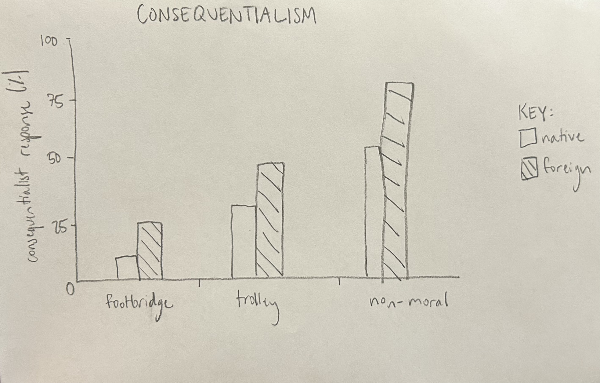
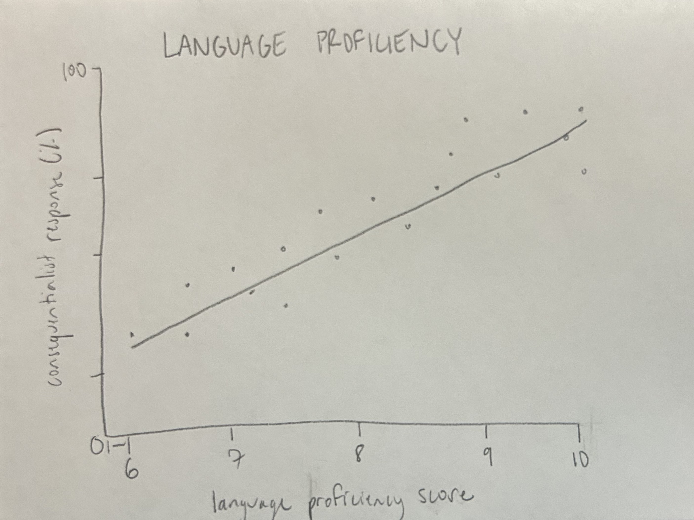

```{r setup, include = FALSE}
library("papaja")
r_refs("r-references.bib")

# add in R script
source("FLDM.R")
```

```{r analysis-preferences}
# Seed for random number generation
set.seed(42)
knitr::opts_chunk$set(cache.extra = knitr::rand_seed)
```

```{r script}
# source R script
source("FLDM.R")
```

```{r helloworld}
# call hello world function
hello_world("French")
```

<!-- Assignment #5 basic markdown formatting practice -->

# **_Formatting Practice_**

## **Ordered List**
### _ToDo List_
1. [D2M Homework](https://nrdowling.github.io/d2m/index.html#Course_schedule) 
2. Put away laundry
3. Unload dishwasher
4. Watch Packers game (go pack)

## **Unordered List**
### _Grocery List_
* Eggs
* Milk
* Bread

```{r data read-in}
# read dataset from csv file into rmd
FLDM_data <- read.csv("S1_Dataset.csv")
```

<!-- data tidying todo
  - remove extra columns (only need r2 mean score, not individuals)
  - arrange participant IDs in order 
  - add zeros before id numbers with stringr to make each id number 3 digits long (consistency) -->

```{r tidy data}
library(dplyr)
# create new tidy dataframe from original dataframe
FLDM_tidy <- FLDM_data %>% 
  # remove unwanted columns
  select(-c(l2.conversation, l2.reading, l2.understanding, l2.writing)) %>% 
  #arrange the ID numbers in ascending order
  arrange(ID)

# export tidy dataframe to a csv file
write_csv(FLDM_tidy, "~/Desktop/UCHI Q2/d2m/foreign-language-decisions/FLDM_tidy.csv") 
```

  
# Methods
We report how we determined our sample size, all data exclusions (if any), all manipulations, and all measures in the study. <!-- 21-word solution (Simmons, Nelson & Simonsohn, 2012; retrieved from http://ssrn.com/abstract=2160588) -->

## Participants

## Material

## Procedure

## Data analysis
We used `r cite_r("r-references.bib")` for all our analyses.

# Assignment 10 plot markups
```{r consequentialism plot }
library(ggplot2)

## plot showing average choices for each moral dilemma in native versus foreign lang.

# format: bar graph
# y axis: % consequentialist (based on choices 1 = consequentialist or 0 = deontological)
# x axis: 3 chunks (trolley, footbridge, non-moral) each with 2 bars (1/lang. condition)
# expectation: foreign lang. condition is more consequential in all condition

FLDM_tidy_long %>% 
  ggplot(aes(x = dilemma.type, y = dilemma.choice)) +
  geom_bar(stat = "identity")

# need to figure out how to seperate dilemma type by language condition
```
 


```{r foreign language proficiency plot}

## plot showing if there is any correlation between proficiency & decision in foreign language condition

# format: line graph
# y axis: same as above, consequentialist response %
# x axis: proficiency in foreign language from 6-10
# expectation: unsure! maybe more proficient leads to more consequential
```



# Results

# Discussion


\newpage

# References

::: {#refs custom-style="Bibliography"}
:::
